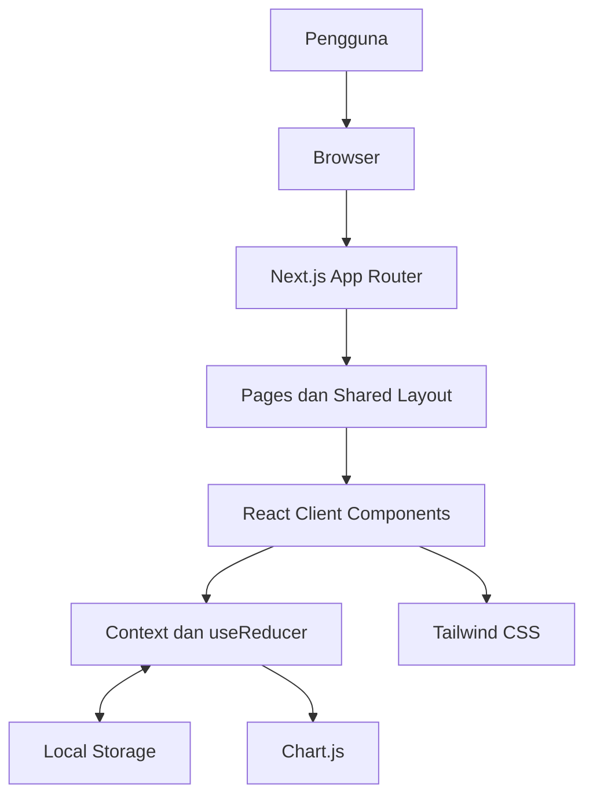
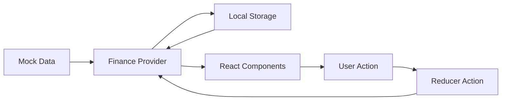
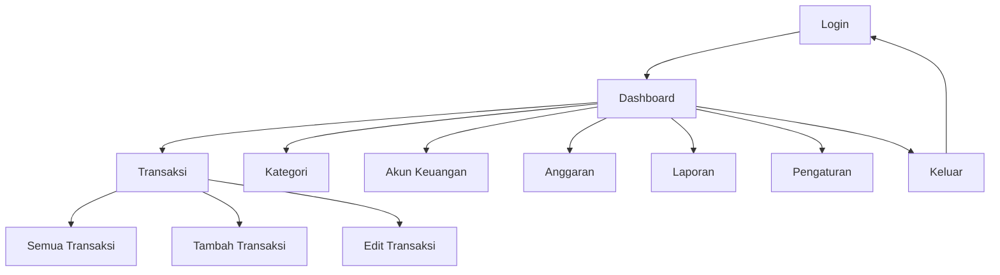
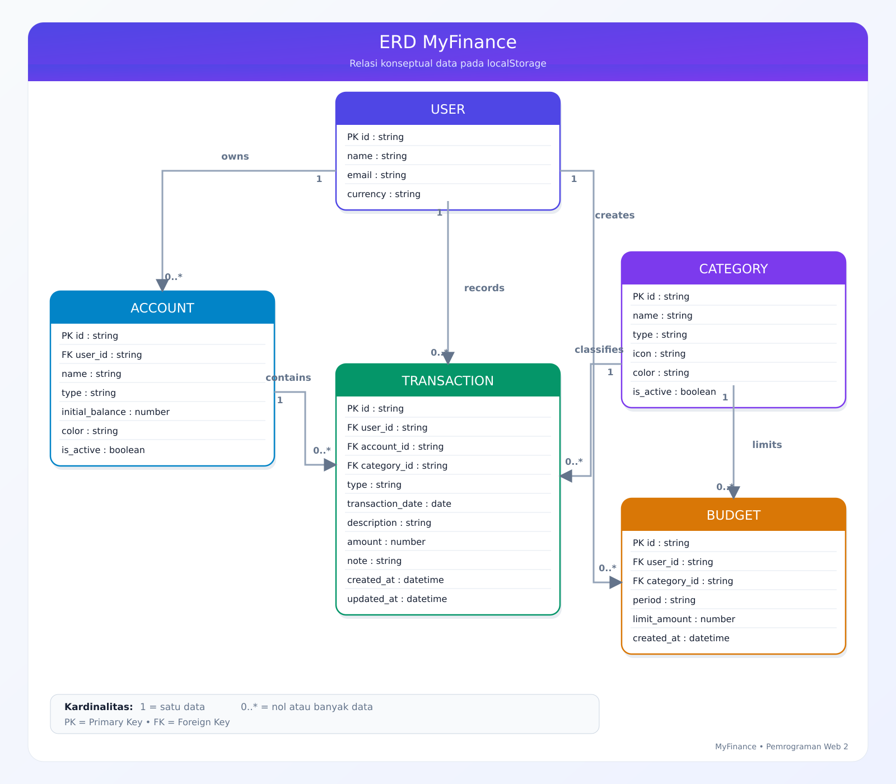
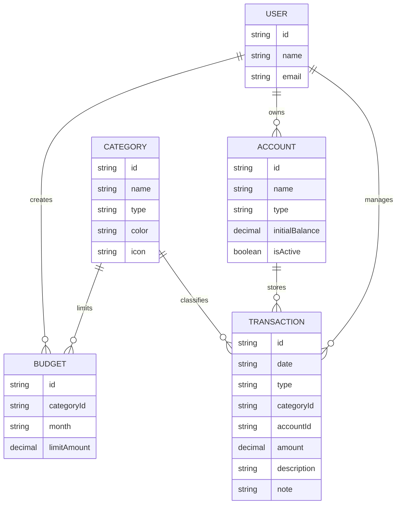
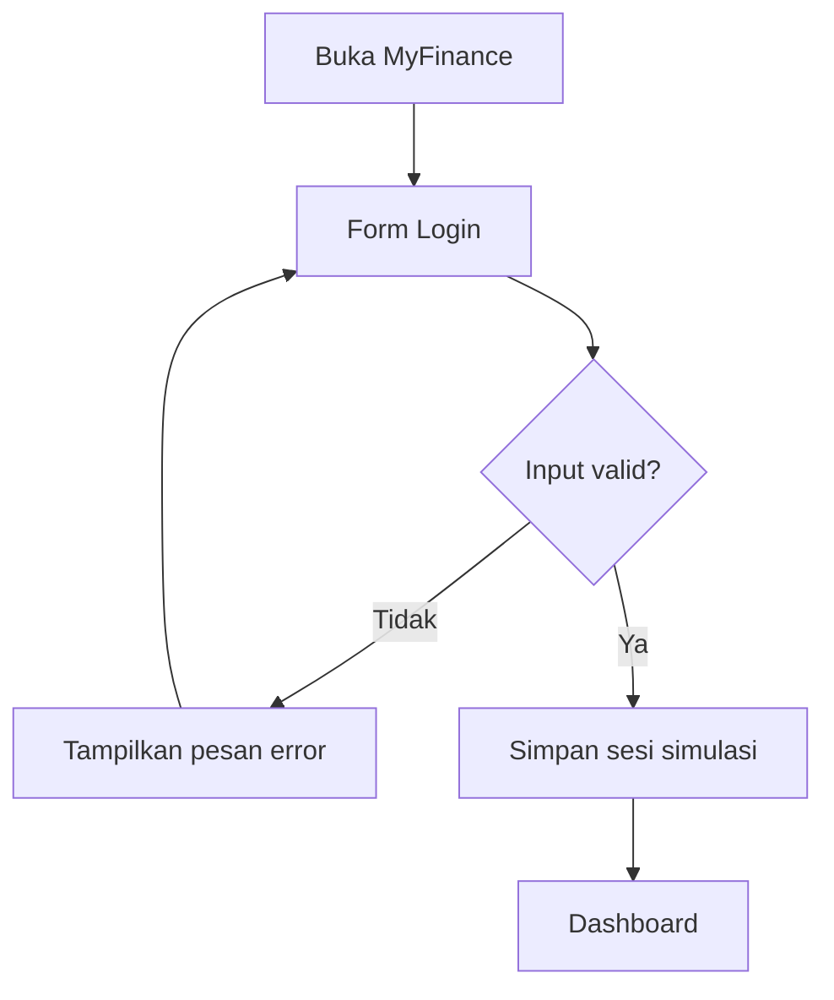
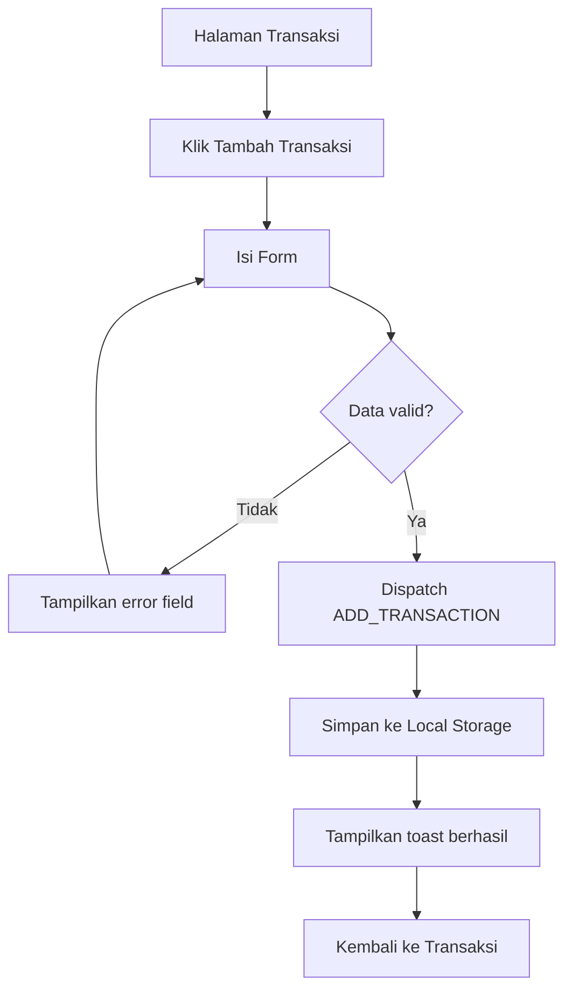
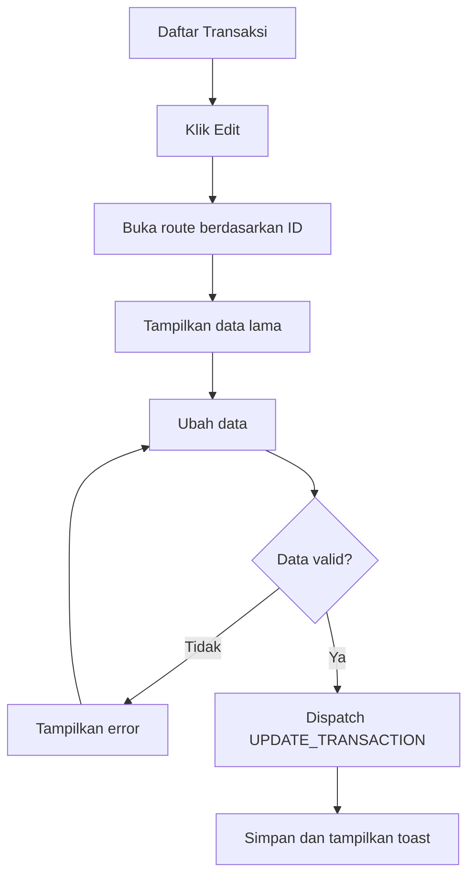
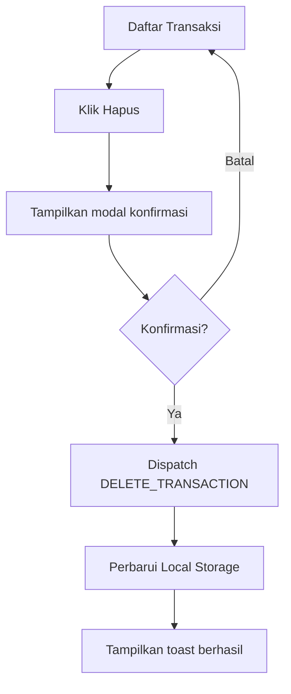
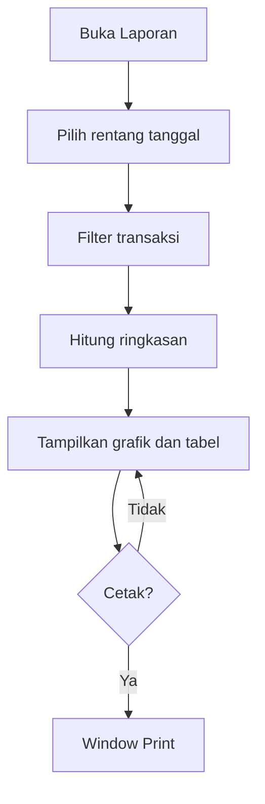

# PERANCANGAN APLIKASI MYFINANCE

> **Project-Based Learning – Pemrograman Web II (Client-Side Programming)**  
> **Jenis sistem:** Aplikasi manajemen keuangan pribadi  
> **Nama aplikasi:** MyFinance  
> **Tema visual:** Premium Glassmorphism  
> **Framework utama:** Next.js App Router  
> **Styling:** Tailwind CSS  
> **Penyimpanan data:** Mock data dan Web Storage (`localStorage`)

---

## 1. Identitas Proyek

| Informasi | Keterangan |
|---|---|
| Nama proyek | MyFinance |
| Jenis aplikasi | Admin panel manajemen keuangan pribadi |
| Mata kuliah | Pemrograman Web II |
| Bentuk tugas | Project-Based Learning – Tugas Mandiri |
| Target pengguna | Individu/pemilik akun |
| Tema desain | Premium Glassmorphism |
| Framework | Next.js 16 dengan App Router |
| UI library | React |
| Bahasa pemrograman | TypeScript |
| Framework CSS | Tailwind CSS |
| Visualisasi data | Chart.js dan React Chart.js 2 |
| Ikon antarmuka | Lucide React |
| State management | React Context dan `useReducer` |
| Penyimpanan | `localStorage` dan mock data |
| Design tool | Figma |
| Package manager | Yarn |
| Version control | Git dan GitHub |
| Deployment | Vercel |
| Backend | Tidak digunakan |
| Database server | Tidak digunakan |

### 1.1 Judul Proyek

**Perancangan dan Implementasi Front-End MyFinance sebagai Aplikasi Manajemen Keuangan Pribadi Menggunakan Next.js dan Tailwind CSS**

### 1.2 Tagline

> **Take Control of Your Money**

### 1.3 Status Perancangan

| Tahap | Status |
|---|---|
| Penentuan konsep aplikasi | Selesai |
| Penyusunan kebutuhan dan ruang lingkup | Selesai |
| ERD dan user flow | Selesai |
| Design system dan high-fidelity design di Figma | Selesai |
| Inisialisasi project Next.js | Selesai |
| Slicing desain ke React dan Tailwind CSS | Milestone 2 diimplementasikan; verifikasi Figma aktif tertunda karena kuota MCP |
| Implementasi CRUD dan interaktivitas | Milestone 3 diimplementasikan; lihat VERIFIKASI_MILESTONE_3.md |
| Pengujian dan deployment | Pengujian lokal dilakukan; cetak native belum terverifikasi; deployment belum dilakukan |

---

## 2. Latar Belakang

Pencatatan keuangan pribadi membantu seseorang mengetahui kondisi keuangannya secara terukur. Namun, pencatatan manual sering kali tidak konsisten, sulit ditelusuri, dan belum mampu memberikan gambaran visual mengenai pola pemasukan maupun pengeluaran.

MyFinance dirancang sebagai aplikasi berbasis web yang membantu pengguna mencatat pemasukan dan pengeluaran, mengelompokkan transaksi, mengelola beberapa akun keuangan, menetapkan batas anggaran, serta melihat ringkasan keuangan melalui dashboard dan laporan visual.

Aplikasi dikembangkan menggunakan Next.js, React, TypeScript, dan Tailwind CSS. Next.js digunakan untuk mengatur routing dan struktur aplikasi, React digunakan untuk membangun komponen antarmuka yang reusable, TypeScript membantu menjaga konsistensi bentuk data, sedangkan Tailwind CSS digunakan untuk menerapkan tampilan responsif sesuai rancangan Figma.

Proyek ini tetap berfokus pada client-side programming. Seluruh pengelolaan data dilakukan pada browser menggunakan React Context, `useReducer`, mock data, dan `localStorage`. Aplikasi tidak menggunakan backend, database server, Route Handler, maupun Server Actions.

---

## 3. Rumusan Masalah

1. Bagaimana merancang aplikasi keuangan pribadi yang informatif dan mudah digunakan?
2. Bagaimana menerapkan desain Figma ke dalam komponen React yang konsisten dan reusable?
3. Bagaimana menampilkan saldo, pemasukan, pengeluaran, dan anggaran secara visual?
4. Bagaimana menerapkan proses tambah, tampil, ubah, dan hapus data tanpa backend?
5. Bagaimana menyimpan data pada browser agar tetap tersedia setelah halaman dimuat ulang?
6. Bagaimana membuat aplikasi responsif untuk desktop, tablet, dan smartphone?
7. Bagaimana mengatur routing dan layout aplikasi menggunakan Next.js App Router?

---

## 4. Tujuan Aplikasi

1. Membantu pengguna mencatat pemasukan dan pengeluaran pribadi.
2. Memberikan informasi saldo dan arus keuangan secara cepat.
3. Membantu pengguna mengetahui kategori pengeluaran terbesar.
4. Membantu pengguna menetapkan dan memantau anggaran bulanan.
5. Menyediakan laporan keuangan berdasarkan periode tertentu.
6. Menerapkan konsep component-based UI menggunakan React.
7. Menerapkan routing dan shared layout menggunakan Next.js App Router.
8. Menerapkan type safety pada data menggunakan TypeScript.
9. Menerapkan CRUD, validasi form, filter, pagination, dan visualisasi data pada sisi client.
10. Menghasilkan antarmuka yang responsif, interaktif, konsisten, dan sesuai desain Figma.

---

## 5. Target Pengguna dan Persona

### 5.1 Target Pengguna

MyFinance ditujukan untuk individu yang ingin mencatat dan memantau keuangan pribadi melalui browser, terutama mahasiswa, pekerja, atau pengguna yang memiliki lebih dari satu sumber penyimpanan uang.

### 5.2 Persona Utama

| Atribut | Keterangan |
|---|---|
| Nama persona | Ridho |
| Usia | 20–30 tahun |
| Aktivitas | Mahasiswa sekaligus pekerja |
| Kebutuhan | Mencatat pendapatan, kebutuhan bulanan, tagihan, dan tabungan |
| Masalah | Sulit mengetahui jumlah pengeluaran dan sisa saldo secara cepat |
| Perangkat | Laptop dan smartphone |
| Tujuan | Mengetahui kondisi keuangan dan mengontrol pengeluaran bulanan |

---

## 6. Ruang Lingkup Proyek

### 6.1 Fitur yang Termasuk

- Simulasi login pengguna.
- Dashboard ringkasan keuangan.
- Pengelolaan transaksi pemasukan dan pengeluaran.
- Pengelolaan kategori transaksi.
- Pengelolaan akun keuangan.
- Pengelolaan anggaran bulanan.
- Pencarian, filter, pengurutan, dan pagination transaksi.
- Grafik pemasukan dan pengeluaran.
- Grafik pengeluaran berdasarkan kategori.
- Laporan berdasarkan rentang tanggal.
- Cetak laporan melalui fitur print browser.
- Validasi form pada sisi client.
- Modal konfirmasi sebelum penghapusan data.
- Toast notification setelah suatu tindakan.
- Penyimpanan data menggunakan `localStorage`.
- Pengaturan tema dan profil sederhana.
- Tampilan responsif pada desktop, tablet, dan smartphone.

### 6.2 Fitur yang Tidak Termasuk

- Registrasi akun sebenarnya.
- Autentikasi dengan server.
- API eksternal atau API internal Next.js.
- Database MySQL, PostgreSQL, atau database server lainnya.
- Server Actions dan Route Handlers.
- Sinkronisasi rekening bank.
- Pembayaran atau transfer uang.
- Integrasi payment gateway.
- Multi-user dan pembagian hak akses.
- Pengiriman email atau push notification.
- Sinkronisasi data lintas perangkat.

### 6.3 Batasan Sistem

1. Data hanya tersimpan pada browser dan perangkat yang digunakan.
2. Data dapat hilang apabila pengguna menghapus penyimpanan browser.
3. Login hanya bersifat simulasi untuk kebutuhan demonstrasi.
4. Perhitungan dashboard dan laporan bersumber dari data transaksi lokal.
5. Aplikasi tidak melakukan transaksi keuangan sungguhan.
6. Aplikasi membutuhkan JavaScript aktif pada browser.

---

## 7. Teknologi yang Digunakan

| Teknologi | Kegunaan |
|---|---|
| Next.js App Router | Routing, layout, navigasi, metadata, dan struktur aplikasi |
| React | Membangun antarmuka berbasis komponen |
| TypeScript | Mendefinisikan tipe data dan mengurangi kesalahan pengolahan data |
| Tailwind CSS | Styling, layout, responsive design, dan glassmorphism |
| React Context | Menyediakan state keuangan untuk seluruh halaman |
| `useReducer` | Mengatur perubahan state CRUD secara terstruktur |
| Browser Storage | localStorage untuk data/profil; sessionStorage untuk sesi simulasi per tab |
| Chart.js | Mesin visualisasi grafik keuangan |
| React Chart.js 2 | Integrasi Chart.js dengan React |
| Lucide React | Menyediakan ikon antarmuka |
| Figma | Design system dan high-fidelity design |
| ESLint | Memeriksa kualitas dan konsistensi source code |
| Yarn | Mengelola package dan menjalankan script project |
| GitHub | Version control dan penyimpanan source code |
| Vercel | Deployment aplikasi Next.js |

### 7.1 Dependency yang Direncanakan

```bash
yarn add lucide-react chart.js react-chartjs-2
```

Dependency dasar seperti `next`, `react`, `react-dom`, `typescript`, `tailwindcss`, dan ESLint telah tersedia dari proses pembuatan project menggunakan `create-next-app`.

---

## 8. Arsitektur Front-End

MyFinance menggunakan arsitektur client-side di atas Next.js App Router. Routing dan layout dikelola oleh Next.js, sementara fitur interaktif dijalankan oleh Client Components React. State utama dikelola melalui Context dan `useReducer`, kemudian disinkronkan dengan `localStorage`.

### 8.1 Diagram Arsitektur



### 8.2 Alur Data



### 8.3 Prinsip Arsitektur

- `page.tsx` digunakan sebagai entry point setiap route.
- `layout.tsx` digunakan untuk elemen antarmuka yang dipakai bersama.
- Komponen UI dipisahkan dari komponen fitur.
- Komponen hanya diberi `"use client"` jika memerlukan state, event, browser API, atau `localStorage`.
- Semua operasi data dilakukan melalui Context dan reducer.
- Fungsi perhitungan dan formatter ditempatkan pada folder `lib`.
- Bentuk data ditetapkan melalui interface TypeScript pada folder `types`.
- Data awal disimpan pada `data/mock-data.ts`.
- Akses `window` dan `localStorage` dilakukan setelah komponen berjalan di browser.
- Tidak ada logika backend di dalam project.

---

## 9. Struktur Folder Proyek

```text
MyFinance/
├── docs/
│   ├── PERANCANGAN.md
│   └── images/
│       ├── 01-arsitektur-frontend.png
│       ├── 02-sitemap.png
│       ├── 03-user-flow-login.png
│       ├── 04-user-flow-tambah-transaksi.png
│       ├── 05-user-flow-edit-transaksi.png
│       ├── 06-user-flow-hapus-transaksi.png
│       ├── 07-user-flow-laporan.png
│       └── 08-erd-relasi-data.png
│
├── front-end/
│   ├── app/
│   │   ├── (auth)/
│   │   │   └── page.tsx
│   │   ├── (dashboard)/
│   │   │   ├── layout.tsx
│   │   │   ├── dashboard/
│   │   │   │   └── page.tsx
│   │   │   ├── transactions/
│   │   │   │   ├── page.tsx
│   │   │   │   ├── new/
│   │   │   │   │   └── page.tsx
│   │   │   │   └── [id]/
│   │   │   │       └── edit/
│   │   │   │           └── page.tsx
│   │   │   ├── categories/
│   │   │   │   └── page.tsx
│   │   │   ├── accounts/
│   │   │   │   └── page.tsx
│   │   │   ├── budgets/
│   │   │   │   └── page.tsx
│   │   │   ├── reports/
│   │   │   │   └── page.tsx
│   │   │   └── settings/
│   │   │       └── page.tsx
│   │   ├── globals.css
│   │   ├── layout.tsx
│   │   ├── loading.tsx
│   │   ├── not-found.tsx
│   │   └── providers.tsx
│   ├── components/
│   │   ├── ui/
│   │   │   ├── Button.tsx
│   │   │   ├── Card.tsx
│   │   │   ├── Input.tsx
│   │   │   ├── Select.tsx
│   │   │   ├── Badge.tsx
│   │   │   ├── Modal.tsx
│   │   │   ├── Toast.tsx
│   │   │   └── Pagination.tsx
│   │   ├── layout/
│   │   │   ├── Sidebar.tsx
│   │   │   ├── Topbar.tsx
│   │   │   ├── MobileSidebar.tsx
│   │   │   ├── Footer.tsx
│   │   │   └── AuthGuard.tsx
│   │   ├── dashboard/
│   │   │   ├── SummaryCard.tsx
│   │   │   ├── FinanceChart.tsx
│   │   │   ├── CategoryChart.tsx
│   │   │   └── RecentTransactions.tsx
│   │   ├── transactions/
│   │   │   ├── TransactionTable.tsx
│   │   │   ├── TransactionForm.tsx
│   │   │   ├── TransactionFilter.tsx
│   │   │   └── DeleteTransactionModal.tsx
│   │   └── budgets/
│   │       └── BudgetProgress.tsx
│   ├── contexts/
│   │   ├── FinanceContext.tsx
│   │   └── ToastContext.tsx
│   ├── hooks/
│   │   ├── useFinance.ts
│   │   └── useLocalStorage.ts
│   ├── lib/
│   │   ├── calculations.ts
│   │   ├── constants.ts
│   │   ├── formatters.ts
│   │   ├── storage.ts
│   │   └── validators.ts
│   ├── data/
│   │   └── mock-data.ts
│   ├── types/
│   │   ├── account.ts
│   │   ├── budget.ts
│   │   ├── category.ts
│   │   ├── finance.ts
│   │   └── transaction.ts
│   ├── public/
│   │   ├── icons/
│   │   ├── images/
│   │   └── logo.svg
│   ├── eslint.config.mjs
│   ├── next.config.ts
│   ├── next-env.d.ts
│   ├── package.json
│   ├── postcss.config.mjs
│   ├── tsconfig.json
│   └── yarn.lock
├── .gitignore
└── README.md
```

### 9.1 Penjelasan Folder Penting

| Folder/File | Fungsi |
|---|---|
| `app` | Menyimpan route, layout, loading state, dan global stylesheet |
| `app/(auth)` | Route login tanpa dashboard layout |
| `app/(dashboard)` | Kumpulan halaman yang menggunakan sidebar dan topbar |
| `components/ui` | Komponen dasar reusable seperti tombol, input, modal, dan badge |
| `components/layout` | Sidebar, topbar, footer, dan penjaga sesi simulasi |
| `components/dashboard` | Komponen khusus halaman dashboard |
| `components/transactions` | Form, tabel, filter, dan modal transaksi |
| `contexts` | Global state keuangan dan toast notification |
| `hooks` | Custom hook untuk mengakses Context dan browser storage |
| `lib` | Helper, formatter, validator, dan perhitungan |
| `data` | Mock data awal aplikasi |
| `types` | Interface dan type TypeScript |
| `public` | Logo dan aset statis yang dapat diakses browser |
| `docs` | Dokumentasi tugas, diagram, dan screenshot rancangan |

### 9.2 File yang Tidak Diunggah ke GitHub

- `front-end/node_modules/`
- `front-end/.next/`
- file environment lokal jika kelak digunakan;
- cache dan file sementara editor.

File `front-end/yarn.lock` harus diunggah agar versi dependency konsisten.

---

## 10. Routing Aplikasi

| Halaman | URL | File |
|---|---|---|
| Login | `/` | `app/(auth)/page.tsx` |
| Dashboard | `/dashboard` | `app/(dashboard)/dashboard/page.tsx` |
| Semua transaksi | `/transactions` | `app/(dashboard)/transactions/page.tsx` |
| Tambah transaksi | `/transactions/new` | `app/(dashboard)/transactions/new/page.tsx` |
| Edit transaksi | `/transactions/[id]/edit` | `app/(dashboard)/transactions/[id]/edit/page.tsx` |
| Kategori | `/categories` | `app/(dashboard)/categories/page.tsx` |
| Akun keuangan | `/accounts` | `app/(dashboard)/accounts/page.tsx` |
| Anggaran | `/budgets` | `app/(dashboard)/budgets/page.tsx` |
| Laporan | `/reports` | `app/(dashboard)/reports/page.tsx` |
| Pengaturan | `/settings` | `app/(dashboard)/settings/page.tsx` |

Route group `(auth)` dan `(dashboard)` hanya digunakan untuk pengorganisasian source code dan tidak muncul pada URL.

---

## 11. Hierarki Menu dan Sitemap



Menu sidebar utama: Dashboard, Transaksi, Kategori, Akun Keuangan, Anggaran, Laporan, Pengaturan, dan Keluar.

---

## 12. Spesifikasi Halaman

### 12.1 Login

- logo dan nama MyFinance;
- tagline aplikasi;
- input email dan password;
- tampilkan/sembunyikan password;
- checkbox “Ingat email” (hanya email, bukan status login);
- tombol masuk;
- pesan validasi;
- sesi simulasi disimpan pada `sessionStorage`, logout disinkronkan antar tab; pemulihan tab browser dapat memulihkan sesi;
- login berhasil diarahkan ke `/dashboard`.

### 12.2 Dashboard

- total saldo;
- pemasukan bulan ini;
- pengeluaran bulan ini;
- sisa anggaran;
- grafik pemasukan dan pengeluaran;
- diagram pengeluaran berdasarkan kategori;
- transaksi terbaru;
- progress anggaran;
- tombol tambah transaksi.

Seluruh nilai dihitung dari state transaksi, akun, dan anggaran, bukan angka statis.

### 12.3 Transaksi

- tabel seluruh transaksi;
- pencarian deskripsi;
- filter jenis, kategori, akun, dan rentang tanggal;
- pengurutan tanggal atau nominal;
- pagination;
- detail, edit, dan hapus transaksi;
- tombol tambah transaksi.

| Kolom | Keterangan |
|---|---|
| Tanggal | Tanggal transaksi |
| Deskripsi | Nama atau tujuan transaksi |
| Kategori | Kategori pemasukan/pengeluaran |
| Akun | Sumber atau tujuan dana |
| Jenis | Pemasukan atau pengeluaran |
| Nominal | Nilai transaksi dalam rupiah |
| Aksi | Detail, edit, dan hapus |

### 12.4 Form Transaksi

Field terdiri dari tanggal, jenis, kategori, akun, nominal, deskripsi, dan catatan opsional. Form digunakan untuk tambah dan edit. Halaman edit mengambil ID dari dynamic route `[id]`.

### 12.5 Kategori

Menampilkan nama, jenis, warna, ikon, jumlah transaksi, serta aksi edit dan hapus.

### 12.6 Akun Keuangan

Contoh akun: Tunai, BCA, SeaBank, dan GoPay. Informasi meliputi nama, jenis, saldo, ikon, status, serta aksi edit dan hapus.

### 12.7 Anggaran

Menampilkan kategori, periode, nilai anggaran, nilai terpakai, sisa, persentase, progress bar, dan status aman/hampir habis/terlampaui.

### 12.8 Laporan

- filter tanggal awal dan akhir;
- total pemasukan dan pengeluaran;
- saldo bersih;
- grafik tren;
- rincian per kategori;
- tabel transaksi;
- tombol cetak.

### 12.9 Pengaturan

- profil pengguna simulasi;
- preferensi format mata uang;
- tema;
- reset data;
- informasi aplikasi.

---

## 13. Rancangan Komponen React

### 13.1 Komponen UI Dasar

| Komponen | Kegunaan |
|---|---|
| `Button` | Primary, secondary, danger, icon, dan loading button |
| `Card` | Kontainer glassmorphism |
| `Input` | Input teks, email, password, tanggal, dan nominal |
| `Select` | Pemilihan jenis, kategori, akun, dan periode |
| `Badge` | Status pemasukan, pengeluaran, dan anggaran |
| `Modal` | Konfirmasi hapus dan dialog informasi |
| `Toast` | Notifikasi berhasil atau gagal |
| `Pagination` | Navigasi halaman data |

### 13.2 Komponen Layout

| Komponen | Kegunaan |
|---|---|
| `Sidebar` | Navigasi utama desktop |
| `MobileSidebar` | Drawer navigasi pada layar kecil |
| `Topbar` | Search, notification, dan profile |
| `Footer` | Informasi copyright |
| `AuthGuard` | Memeriksa sesi login simulasi pada browser |

### 13.3 Prinsip Komponen

- Setiap komponen memiliki satu tanggung jawab utama.
- Props memiliki type TypeScript.
- Tampilan berulang tidak ditulis ulang di setiap halaman.
- Komponen UI tidak menangani aturan bisnis.
- Perhitungan disimpan pada fungsi khusus di folder `lib`.
- State global hanya digunakan untuk data lintas halaman.

---

## 14. Model Data TypeScript

```ts
type TransactionType = "income" | "expense";

interface Transaction {
  id: string;
  date: string;
  type: TransactionType;
  categoryId: string;
  accountId: string;
  amount: number;
  description: string;
  note?: string;
  createdAt: string;
  updatedAt: string;
}

interface Category {
  id: string;
  name: string;
  type: TransactionType;
  color: string;
  icon: string;
}

interface Account {
  id: string;
  name: string;
  type: "cash" | "bank" | "e-wallet";
  initialBalance: number;
  icon: string;
  isActive: boolean;
}

interface Budget {
  id: string;
  categoryId: string;
  month: string;
  limitAmount: number;
}

interface UserPreference {
  name: string;
  email: string;
  currency: "IDR";
  theme: "dark" | "light";
}
```

---

## 15. ERD dan Relasi Data





Walaupun tidak memakai database server, ERD menjelaskan hubungan konseptual antarentitas.

---

## 16. Penyimpanan Browser

| Key | Isi |
|---|---|
| `myfinance_data_v1` | Transaksi, kategori, akun, anggaran, dan preferensi |
| `myfinance_session_v1` | Key lama localStorage; hanya migrasi email, status login diabaikan |
| `myfinance_tab_session_v1` | sessionStorage: status login dan versi logout per tab |
| `myfinance_remembered_email_v1` | localStorage: email yang diingat atau string kosong |
| `myfinance_logout_version_v1` | localStorage: penanda invalidasi sesi setelah logout |
| `myfinance_avatar_v1` | localStorage: foto profil JPEG 256×256, terpisah dari data keuangan |

```ts
interface FinanceState {
  transactions: Transaction[];
  categories: Category[];
  accounts: Account[];
  budgets: Budget[];
  preference: UserPreference;
  initialized: boolean;
}
```

### 16.1 Aturan Inisialisasi

1. Provider berjalan sebagai Client Component.
2. Setelah komponen dipasang, aplikasi memeriksa `localStorage`.
3. Data lokal yang valid digunakan sebagai state awal.
4. Jika belum tersedia, aplikasi menggunakan mock data.
5. Setiap perubahan state disinkronkan ke `localStorage`.
6. Render awal tidak membaca `window` atau `localStorage` secara langsung untuk mencegah hydration mismatch.

### 16.2 Reducer Action

```text
INITIALIZE_DATA
ADD_TRANSACTION
UPDATE_TRANSACTION
DELETE_TRANSACTION
ADD_CATEGORY
UPDATE_CATEGORY
DELETE_CATEGORY
ADD_ACCOUNT
UPDATE_ACCOUNT
DELETE_ACCOUNT
ADD_BUDGET
UPDATE_BUDGET
DELETE_BUDGET
UPDATE_PREFERENCE
RESET_DATA
```

---

## 17. User Flow

### 17.1 Login



### 17.2 Tambah Transaksi



### 17.3 Edit Transaksi



### 17.4 Hapus Transaksi



### 17.5 Laporan



---

## 18. Aturan Validasi

### Login

- email wajib dan harus valid;
- password wajib dan minimal enam karakter.

### Transaksi

- tanggal, jenis, kategori, akun, nominal, dan deskripsi wajib diisi;
- kategori harus sesuai jenis transaksi;
- nominal harus lebih besar dari nol;
- catatan bersifat opsional.

### Kategori

- nama, jenis, warna, dan ikon wajib diisi;
- nama kategori tidak boleh duplikat untuk jenis yang sama;
- kategori yang digunakan transaksi tidak boleh langsung dihapus tanpa peringatan.

### Akun

- nama dan jenis akun wajib diisi;
- saldo awal harus valid;
- akun yang digunakan transaksi tidak boleh langsung dihapus tanpa peringatan.

### Anggaran

- kategori pengeluaran, periode, dan nilai wajib diisi;
- nilai harus lebih besar dari nol;
- satu kategori hanya memiliki satu anggaran pada periode yang sama.

Pesan kesalahan ditampilkan di bawah field terkait, bukan hanya menggunakan `alert()`.

---

## 19. Aturan Bisnis dan Perhitungan

```text
Total saldo = total saldo awal akun + total pemasukan - total pengeluaran
Saldo akun = saldo awal akun + pemasukan akun - pengeluaran akun
Sisa anggaran = batas anggaran - pengeluaran kategori pada periode tersebut
```

| Penggunaan Anggaran | Status |
|---:|---|
| 0–79% | Aman |
| 80–100% | Hampir habis |
| Lebih dari 100% | Terlampaui |

```ts
const formatRupiah = (value: number) =>
  new Intl.NumberFormat("id-ID", {
    style: "currency",
    currency: "IDR",
    minimumFractionDigits: 0,
  }).format(value);
```

---

## 20. Design System

### 20.1 Warna

| Token | Nilai | Kegunaan |
|---|---|---|
| Primary | `#6366F1` | Tombol dan elemen utama |
| Secondary | `#8B5CF6` | Gradient dan aksen sekunder |
| Income | `#10B981` | Pemasukan dan status positif |
| Expense | `#F43F5E` | Pengeluaran dan status negatif |
| Warning | `#F59E0B` | Peringatan anggaran |
| Background | `#070B1A` | Latar utama dark mode |
| Surface | `rgba(255,255,255,0.08)` | Panel glassmorphism |
| Border | `rgba(255,255,255,0.12)` | Border panel |
| Text Primary | `#F8FAFC` | Teks utama |
| Text Secondary | `#94A3B8` | Teks pendukung |

### 20.2 Tipografi, Spacing, dan Radius

- font utama Inter;
- heading menggunakan bobot 600–700;
- body menggunakan bobot 400–500;
- spacing mengikuti kelipatan 4 px;
- radius input dan tombol 12 px;
- radius card 16–20 px;
- panel menggunakan background transparan, blur, border lembut, dan shadow terkontrol.

---

## 21. Responsive Design

### Desktop – `1024px` ke atas

- sidebar permanen;
- summary card empat kolom;
- grafik dua kolom;
- tabel penuh.

### Tablet – `768px` sampai `1023px`

- sidebar dapat disembunyikan;
- summary card dua kolom;
- grafik menyesuaikan satu atau dua kolom;
- tabel dapat digeser horizontal.

### Mobile – di bawah `768px`

- sidebar menjadi drawer;
- card dan grafik satu kolom;
- tabel dapat digeser horizontal;
- filter menggunakan panel ringkas;
- tombol utama tetap mudah dijangkau.

---

## 22. Mock Data

Data awal minimal terdiri dari 25 transaksi beberapa bulan, 10 kategori, 4 akun, 5 anggaran, dan 1 profil simulasi.

Contoh kategori pengeluaran: Makanan, Transportasi, Tempat Tinggal, Tagihan, Hiburan, Pendidikan, dan Kesehatan. Contoh kategori pemasukan: Gaji, Bonus, dan Pendapatan Tambahan.

---

## 23. Accessibility dan UX

- tombol memiliki label jelas;
- icon-only button memiliki `aria-label`;
- field terhubung dengan label;
- fokus keyboard terlihat;
- modal dapat ditutup dengan tombol batal dan `Escape`;
- warna bukan satu-satunya pembeda informasi;
- kontras teks dijaga;
- loading dan empty state tersedia;
- tindakan berisiko menggunakan konfirmasi.

---

## 24. Strategi Pengujian

### 24.1 Functional Testing

- login valid/tidak valid;
- CRUD transaksi, kategori, akun, dan anggaran;
- pencarian, filter, sorting, dan pagination;
- perhitungan saldo dan anggaran;
- grafik dinamis;
- cetak laporan;
- logout dan reset data.

### 24.2 Storage dan Routing Testing

- mock data muncul ketika storage kosong;
- data bertahan setelah refresh;
- perubahan CRUD tersimpan;
- data rusak ditangani dengan fallback;
- setiap menu membuka route yang benar;
- edit route membaca ID;
- pengguna tanpa sesi diarahkan ke login;
- route tidak dikenal menampilkan halaman 404.

### 24.3 Responsive Testing

- desktop 1440 px;
- laptop 1024 px;
- tablet 768 px;
- mobile 375 px;
- tabel, grafik, sidebar, modal, dan form diperiksa pada seluruh breakpoint.

### 24.4 Quality Check

```bash
yarn lint
yarn build
```

Build produksi harus berhasil tanpa TypeScript error dan tanpa error akses browser API pada proses server rendering.

---

## 25. Figma

Figma merupakan satu-satunya alat perancangan visual yang digunakan. Google Stitch tidak digunakan.

### 25.1 Cakupan Desain

- foundations dan design tokens;
- reusable components;
- Login, Dashboard, Transaksi, Form Transaksi, Kategori, Akun, Anggaran, Laporan, dan Pengaturan;
- rancangan desktop dan mobile.

### 25.2 Link Figma

<https://www.figma.com/design/j3IYRRaC6W2XK4qUWScRiB>

Pengaturan akses file perlu menggunakan **Anyone with the link can view** sebelum pengumpulan.

### 25.3 Hubungan Figma dan Implementasi

| Figma | Implementasi |
|---|---|
| Frame halaman | Route `page.tsx` |
| Layout dashboard | `app/(dashboard)/layout.tsx` |
| Component set | Reusable React component |
| Color variable | Tailwind theme/CSS variable |
| Typography style | Font dan utility class |
| Auto layout | Flexbox atau CSS Grid |
| Spacing token | Tailwind spacing utility |
| Variant | Props dan conditional class |

---

## 26. Rencana Milestone

### Milestone 1 – Perencanaan dan UI Design

Status: **selesai**.

Hasil: konsep, kebutuhan, ruang lingkup, sitemap, ERD, user flow, design system, high-fidelity Figma, `PERANCANGAN.md`, dan penetapan Next.js sebagai framework implementasi.

### Milestone 2 – Slicing dan Layouting

1. merapikan struktur Next.js;
2. membersihkan starter page;
3. memasang dependency tambahan;
4. menerapkan font dan design tokens;
5. membuat komponen UI reusable;
6. membuat Login dan dashboard layout;
7. membuat seluruh halaman;
8. menyamakan tampilan dengan Figma;
9. memastikan responsivitas.

Pada tahap ini data statis dapat digunakan lebih dahulu. Fokusnya adalah kesesuaian visual, routing, reusable components, dan responsivitas.

#### Catatan implementasi Milestone 2 — 22 September 2026

- Kesepuluh route telah dibuat menggunakan route group, shared layout, dan komponen reusable. ID edit dibaca oleh Client Component; ID di luar fixture menampilkan empty state.
- Referensi visual implementasi adalah sembilan screenshot lokal pada `docs/images` dan token pada dokumen ini. Akses frame Figma `9:3` terhalang kuota MCP paket Starter. Kesesuaian dengan file Figma aktif, termasuk frame mobile, belum disertifikasi.
- Font Inter disimpan lokal beserta lisensi. Wordmark menggunakan teks dan styling; favicon menggunakan aset dompet resmi Lucide sampai aset logo final dari Figma tersedia.
- `data/demo.ts` berisi fixture presentasional. Angka ringkasan dan grafik merupakan contoh visual, belum dihitung dari daftar transaksi. Seed minimum Bab 22 tetap menjadi pekerjaan Milestone 3.
- Tipe presentasional mulai disiapkan pada `types/finance.ts`. Komponen fitur kategori, akun, laporan, dan pengaturan ditempatkan pada folder fitur masing-masing. Folder dan file state keuangan dibuat saat digunakan pada Milestone 3.
- Toast Context digunakan hanya untuk umpan balik pratinjau. Tidak ada Finance Context, reducer CRUD, sesi aktif, atau operasi localStorage. Key storage Bab 16 disediakan sebagai konstanta untuk tahap berikutnya.
- Login hanya memvalidasi bentuk input sebelum membuka demo, tanpa menyimpan password atau sesi. Tombol tindakan data dan pengaturan menampilkan pratinjau; filter tidak mengubah dataset dan pagination menunjukkan enam baris contoh dalam satu halaman.
- `yarn lint`, `yarn typecheck`, dan `yarn build` digunakan untuk quality check. Script Yarn menunjuk entry point CLI lokal melalui Node untuk mengatasi kegagalan resolusi executable `.bin` pada lingkungan Windows audit.
- Root Git berada di `MyFinance`, mencakup dokumentasi dan aplikasi. Dependency, cache, build, environment lokal, dan artefak verifikasi diabaikan. Tidak ada repository terpisah di `front-end`.

### Milestone 3 – Interaktivitas dan Data Client-Side

Catatan 23 September 2026: implementasi lokal mencakup CRUD, validasi, penyimpanan, sesi simulasi, filter, grafik, laporan, profil/tema, dan reset kosong. Reset mempertahankan array kosong setelah refresh serta memandu pembuatan kategori dan akun. Data awal berada di `data/mock-data.ts`; tipe terpusat di `types/finance.ts`; provider dan aturan bisnis ada di `contexts/FinanceContext.tsx` serta `lib`. Rincian pengujian dan batas cetak native: [VERIFIKASI_MILESTONE_3.md](VERIFIKASI_MILESTONE_3.md). Commit, push, dan deploy dikecualikan sesuai instruksi pengguna.


1. membuat interface TypeScript dan mock data;
2. membuat Context dan reducer;
3. menghubungkan state dengan `localStorage`;
4. membuat login/logout simulasi;
5. mengimplementasikan seluruh CRUD;
6. menambahkan validasi, filter, sorting, dan pagination;
7. menambahkan modal dan toast;
8. membuat grafik dinamis dan laporan cetak;
9. melakukan pengujian;
10. menjalankan lint dan build;
11. push ke GitHub dan deploy ke Vercel.

---

## 27. Rencana Implementasi Bertahap

| Urutan | Pekerjaan | Output |
|---:|---|---|
| 1 | Audit hasil `create-next-app` | Struktur awal terverifikasi |
| 2 | Atur route group dan layout | Routing dasar |
| 3 | Terapkan design tokens | Style konsisten |
| 4 | Buat komponen UI | Komponen reusable |
| 5 | Buat layout aplikasi | Sidebar dan topbar |
| 6 | Slicing Dashboard | Dashboard responsif |
| 7 | Slicing Transaksi | Tabel, filter, dan form |
| 8 | Slicing halaman lain | Semua route tersedia |
| 9 | Buat types dan mock data | Model data siap |
| 10 | Buat Context dan reducer | State terstruktur |
| 11 | Integrasi Local Storage | Data persisten |
| 12 | Implementasi CRUD | Fitur data berfungsi |
| 13 | Grafik dan laporan | Visualisasi dan cetak |
| 14 | Pengujian | Aplikasi stabil |
| 15 | Deployment | GitHub dan Vercel |

---

## 28. Risiko dan Mitigasi

| Risiko | Dampak | Mitigasi |
|---|---|---|
| Mengakses `localStorage` saat server render | Hydration error | Akses setelah mount pada Client Component |
| Terlalu banyak `"use client"` | Bundle membesar | Gunakan hanya pada komponen interaktif |
| State dan storage tidak sinkron | Data berbeda | Semua mutasi melalui reducer dan satu storage service |
| Bentuk data tidak konsisten | Error perhitungan | Gunakan TypeScript dan validasi |
| Grafik memakai angka statis | Laporan tidak akurat | Dataset dibentuk dari transaksi |
| Desain tidak konsisten | Berbeda dari Figma | Gunakan token dan reusable component |
| Repository terpisah | Dokumentasi tidak terunggah | Pastikan Git root mencakup `docs` dan `front-end` |
| `node_modules` ikut terunggah | Repository sangat besar | Pastikan `.gitignore` aktif |

---

## 29. Checklist Proyek

### Milestone 1

- [x] Konsep dan target pengguna ditentukan.
- [x] Fitur dan batasan ditentukan.
- [x] Sitemap, user flow, dan ERD dibuat.
- [x] Design system dan high-fidelity Figma dibuat.
- [x] Link Figma dicantumkan.
- [x] `PERANCANGAN.md` disusun.
- [x] Teknologi diperbarui menjadi Next.js.
- [x] Stitch dikeluarkan dari scope.

### Milestone 2

- [x] Struktur App Router dirapikan.
- [x] Design tokens diterapkan.
- [x] Reusable components dibuat.
- [x] Login dan dashboard layout dibuat.
- [x] Semua halaman dibuat.
- [x] Responsivitas diperiksa pada 1440, 1024, 768, dan 375 px menggunakan referensi screenshot lokal.
- [ ] Kesesuaian final desktop dan mobile diverifikasi terhadap file Figma aktif setelah akses tersedia.

### Milestone 3

- [x] Mock data, Context, dan reducer dibuat.
- [x] Local Storage terintegrasi.
- [x] CRUD dan validasi berfungsi.
- [x] Filter, sorting, dan pagination berfungsi.
- [x] Modal dan toast berfungsi.
- [x] Grafik menggunakan data transaksi.
- [ ] Tombol dan CSS cetak telah diimplementasikan; verifikasi pratinjau printer/PDF native masih diperlukan.
- [x] `yarn lint` dan `yarn build` berhasil.
- [ ] Repository GitHub dan deployment Vercel tersedia.

---

## 30. Referensi Teknis

- Next.js: <https://nextjs.org/docs>
- Project Structure: <https://nextjs.org/docs/app/getting-started/project-structure>
- Server and Client Components: <https://nextjs.org/docs/app/getting-started/server-and-client-components>
- React: <https://react.dev/>
- TypeScript: <https://www.typescriptlang.org/docs/>
- Tailwind CSS: <https://tailwindcss.com/docs>
- Tailwind CSS with Next.js: <https://tailwindcss.com/docs/installation/framework-guides/nextjs>
- Chart.js: <https://www.chartjs.org/docs/latest/>
- React Chart.js 2: <https://react-chartjs-2.js.org/>
- Lucide React: <https://lucide.dev/guide/packages/lucide-react>
- Web Storage API: <https://developer.mozilla.org/en-US/docs/Web/API/Web_Storage_API>
- Figma: <https://www.figma.com/>
- Vercel: <https://vercel.com/docs>

---

## 31. Kesimpulan Perancangan

MyFinance akan dikembangkan sebagai aplikasi manajemen keuangan pribadi berbasis Next.js App Router, React, TypeScript, dan Tailwind CSS. Aplikasi tetap berfokus pada client-side programming dengan React Context, `useReducer`, mock data, dan `localStorage` sebagai pusat pengelolaan data.

Struktur project memisahkan routing, layout, komponen UI, logika fitur, model data, dan helper secara jelas. Figma menjadi satu-satunya sumber desain visual, sedangkan implementasi akan diuji pada berbagai ukuran layar sebelum dipublikasikan melalui GitHub dan Vercel.

Dokumen ini menjadi acuan Milestone 2 dan Milestone 3. Perubahan fitur atau struktur setelah implementasi harus dicatat kembali agar dokumentasi tetap sesuai dengan aplikasi.
